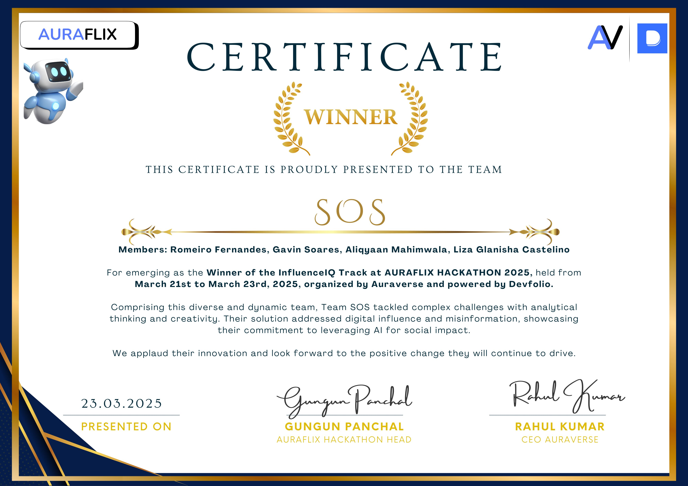
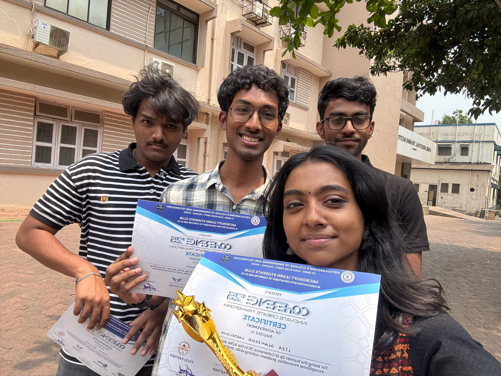

  
  <!-- Typing SVG -->
  

     
  

  <!-- 🏆 Achievements Section -->
  <h3 align="left" style="margin-top: 40px;">🏆 Achievements:</h3>

  

    

      
      <h4 style="color: #1ACD55;">Winner - AuraFlix Hackathon (AIML Track)</h4>
      
Secured 1st place at AuraFlix Hackathon under the Artificial Intelligence and Machine Learning track. Developed an innovative solution powered by ML to solve real-world problems.

      <a href="https://github.com/yourusername/auraflix-project" target="_blank" style="color: #1ACD55; margin-right: 15px;">🔗 GitHub</a>
      <a href="https://devfolio.co/projects/auraflix-xyz" target="_blank" style="color: #1ACD55; margin-right: 15px;">🌐 Devfolio</a>
      <a href="https://www.linkedin.com/posts/your-profile-id_auraflix-win" target="_blank" style="color: #1ACD55;">💼 LinkedIn</a>
    

    

      
        
      <h4 style="color: #1ACD55;">Runner-Up - Coherence-25 (AIML Track)</h4>
      
Achieved Runner-Up position in the AIML track at Coherence-25. The project demonstrated advanced machine learning techniques with practical impact in the sustainability space.

      <a href="https://github.com/yourusername/coherence25-project" target="_blank" style="color: #1ACD55; margin-right: 15px;">🔗 GitHub</a>
      <a href="https://devfolio.co/projects/coherence25" target="_blank" style="color: #1ACD55; margin-right: 15px;">🌐 Devfolio</a>
      <a href="https://www.linkedin.com/posts/your-profile-id_coherence25-hackathon" target="_blank" style="color: #1ACD55;">💼 LinkedIn</a>
    

  

  <!-- 👩‍💻 Languages and Tools -->
  <h3 align="left">Languages and Tools:</h3>
  

    <h5 align="left">Programming Languages:</h5>
    
    
    
     
  

